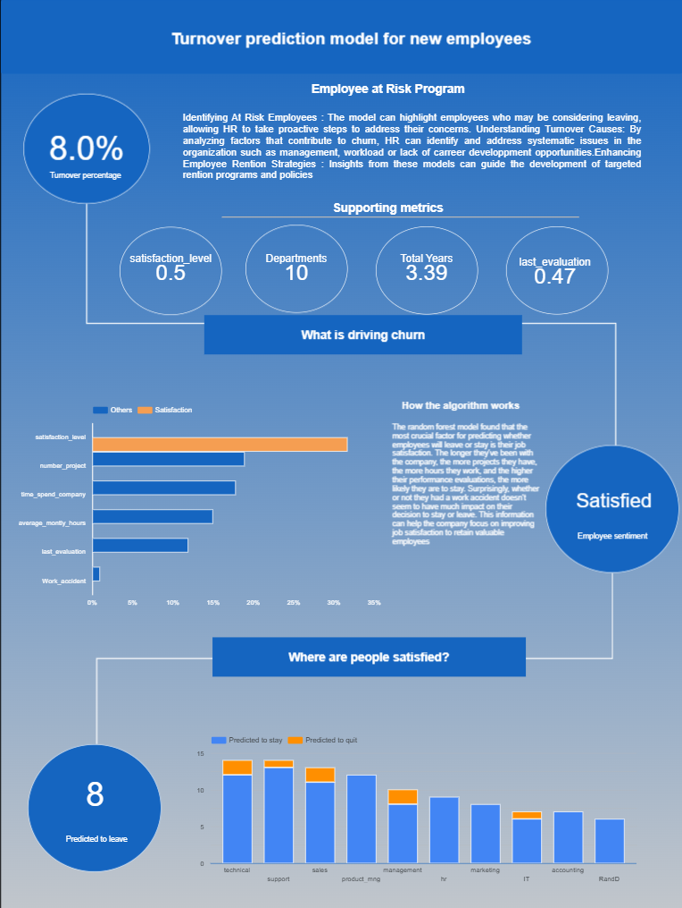

# Employee Turnover Prediction Model

This is a repository for a data modeling project to predict which employees are at risk of leaving the company.

This project uses the following tech stacks:

- GCP (Google Cloud Platform) BigQuery to store raw data, tables, and views
- Google Colab to train, test, and predict the model using Python SciKit-Learn library
- Looker Studio (now DataStudio) to create an interactive data visualization

This repository contains the raw data, the queries used in the project, and the ipynb notebook used for training the model.

The LookerStudio Dashboard can be viewed through here : [LINK](https://datastudio.google.com/reporting/81e82456-2caa-4fa9-b227-842d4c4e5512 "LookerStudio Dashboard")

